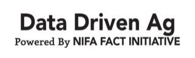

This repository contains tutorial and other material for the 2018 [Data Driven Ag](https://www.datadrivenag.org) workshop.  This includes data; notebooks and sample code; along with instructions for accessing the [Workbench](https://www.workshop1.nationaldataservice.org) system for remote, interactive access to sample data.

## Tutorials
Tutorial materials are provided for the following:
* [Plant height prediction](height_prediction)

## Workbench
The Workbench system is intended to provide web-based access to pre-configured data and software for the DataDrivenAg hackathon. For more information about accessing and using workbench, see the [Quickstart Guide](workbench.md) or the following brief video:

